# 🎓 Eduverse eLearning Platform Backend

<div align="center">


**A robust and scalable RESTful API powering a university-level eLearning ecosystem** 🚀

*Seamlessly connect **Admins**, **Professors**, and **Students** in one unified platform*

[🚀 Quick Start](#installation-) • [📖 API Docs](#api-endpoints-) • [🛠️ Tech Stack](#technology-stack-️) • [🤝 Contribute](#contributing-)

</div>

---

## 📋 Table of Contents

<details>
<summary>Click to expand navigation</summary>

- [🌟 Project Overview](#project-overview-)
- [✅ Key Features](#key-features-)
- [🛠️ Technology Stack](#technology-stack-️)
- [🏗️ System Architecture](#system-architecture-️)
- [🌐 API Workflow](#api-workflow-)
- [💳 Payment Workflow](#payment-workflow-)
- [📊 Data Models](#data-models-)
- [🧑‍🏫 User Flows](#user-flows-️)
- [📈 Summary Workflow](#summary-workflow-)
- [⚙️ Prerequisites](#prerequisites-️)
- [🔧 Installation](#installation-)
- [📖 Usage](#usage-)
- [🔗 API Endpoints](#api-endpoints-)
- [🤝 Contributing](#contributing-)
- [❓ FAQ](#faq-)
- [📜 License](#license-)
- [📧 Contact](#contact-)

</details>

---

## 🌟 Project Overview

**Eduverse** transforms university education through a comprehensive eLearning platform that seamlessly connects three distinct user experiences. Built with modern web technologies, it delivers **multi-dashboard access** for Admins, Professors, and Students across web and mobile interfaces with integrated payment processing.

```mermaid
mindmap
  root((🎓 Eduverse))
    🔐 Authentication
      JWT Security
      Role-based Access
      Password Encryption
    📚 Course Management
      Dynamic Content
      Real-time Updates
      File Integration
    💳 Payment Processing
      Stripe Integration
      Automatic Billing
      Access Control
    👥 Multi-User Support
      Admin Dashboard
      Professor Portal
      Student Interface
```

<div align="center">



</div>

---

## Key Features ✅

- 🔐 **Secure Authentication**: Role-based login (Admin, Professor, Student) with JWT and bcrypt.
- 📚 **Course Management**: Create, update, and manage courses with lectures and assignments.
- 📝 **Assignment Workflow**: Upload, submit, and track assignments with statuses (pending, submitted, missed).
- 🎥 **Lecture Delivery**: Organize and deliver lecture content with file uploads.
- 📋 **Enrollment System**: Manage student course enrollments seamlessly.
- 💳 **Payment Processing**: Integrated Stripe payment system with automatic access control.
- 💰 **Payment Tracking**: Monitor course payments with configurable hourly rates and terms.
- 🚪 **Access Control**: Automatic platform access based on payment status.
- ⚡ **Scalable Architecture**: Modular design with real-time database syncing and structured error handling.
- 📘 **API Documentation**: Interactive Swagger UI for developers.

---

## 🛠️ Technology Stack

<div align="center">

### **Backend Powerhouse**

| Layer | Technology | Purpose | Status |
|-------|------------|---------|--------|
| **🚀 Runtime** | Node.js v16+ | High-performance JavaScript runtime |  |
| **🌠Framework** | Express.js | RESTful API server & middleware |  |
| **🗄️ Database** | MongoDB + Mongoose | Document-based data storage |  |
| **🔠Auth** | JWT + bcrypt | Secure token-based authentication |  |
| **💳 Payment** | Stripe API | Secure payment processing |  |
| **📠Docs** | Swagger UI | Interactive API documentation |  |
| **🧪 Testing** | Postman | API testing |  |

</div>

> **Note**: This repository contains the backend only. Frontend dashboards are in separate repositories.

---

## System Architecture 🏗️

Eduverse follows a modular architecture for scalability. The diagram below shows the core components and their interactions.


---

## API Workflow 🌐

The backend provides a clean, RESTful API structure with role-based access control. Below is the workflow for key operations.

### 1. Authentication & Authorization 🔐
- **Endpoints**: `/api/auth/register`, `/api/auth/login`
- **Workflow**:
  1. Users authenticate via a unified login endpoint.
  2. A JWT token is issued upon successful login.
  3. Middleware enforces role-based access on protected endpoints.


### 2. User Management 🧑‍💼
- **Endpoints**: `/api/users`, `/api/users/:id`
- **Actions**: Create, update, delete, list users (Admin-only).
- **Workflow**: Admins manage users via dashboard, triggering API calls.

### 3. Course Management 📚
- **Endpoints**: `/api/courses`, `/api/courses/:id`
- **Actions**: Create, update, delete, list courses (Admin/Professor).
- **Workflow**:
  - Admins assign professors to courses.
  - Professors manage course content (lectures, assignments).

### 4. Enrollment Management 📋
- **Endpoints**: `/api/enrollments`, `/api/enrollments/:id`
- **Actions**: Enroll students, view enrollments (Admin/Student).
- **Workflow**: Admins enroll students; students view enrolled courses.

### 5. Lecture & Assignment Management 🎥📝
- **Endpoints**: `/api/lectures`, `/api/assignments`
- **Actions**: Professors upload content linked to courses.
- **Workflow**: Files are stored and associated with courses via API.

### 6. Assignment Submission 📤
- **Endpoints**: `/api/submissions`
- **Actions**: Students submit assignments; API updates status.
- **Workflow**: Students upload files; API validates and stores submissions.

### 7. Profile Management 🧑
- **Endpoints**: `/api/users/me`, `/api/users/:id`
- **Actions**: View and update profile information (all roles).

### 8. API Documentation 📘
- **Endpoint**: `/api-docs`
- **Workflow**: Developers access Swagger UI for endpoint details and testing.

---

## Payment Workflow 💳

The payment system is integrated with Stripe to provide secure payment processing and automatic access control.

### Student Payment Flow


### Detailed Payment Workflow Steps

#### 1. Student Payment Process
1. **Student Authentication**: Student successfully logs in with credentials
2. **Automatic Payment Check**: Frontend automatically calls `GET /api/payment/student/status`
3. **Platform Access Control**:
   - If payment exists and `isPaid: true` → Allow platform access - redirect to student dashboard/courses
   - If no payment record or `isPaid: false` → Block platform access - redirect to payment gate page
4. **Payment Gate Page**: Student sees two options:
   - "Pay Now" button → Proceed to payment
   - "Logout" button → Logout from platform
5. **Payment Process**: If student clicks "Pay Now":
   - Call `POST /api/payment/create-session`
   - Redirect student to Stripe checkout URL from response
6. **Stripe Payment**: Student completes payment on Stripe
7. **Payment Result**:
   - Success → Student redirected to success page, can now access platform
   - Failure → Student redirected to failure page, still blocked from platform
8. **Webhook Processing**: Stripe webhook updates payment status in background

#### 2. Admin Payment Management Workflow


**Admin Dashboard Flow**: Admin Login → Dashboard → Payments Section → Payment Config + Student Search

**Detailed Admin Workflow Steps**:

1. **Payment Configuration Management**
   - Load Current Config: Admin opens payments page, frontend calls `GET /api/paymentConfig`
   - Display Config Form: Show current `hourRate` and `term` values in editable form
   - Update Config: Admin modifies values and submits, frontend calls `POST /api/paymentConfig`
   - Confirmation: Show success message and updated values

2. **Student Payment Search**
   - Search Form: Admin fills search form with:
     - Student name (text input)
     - Level (dropdown: 0-5)
     - Term (dropdown: 1-2)
   - Search Request: Frontend calls `GET /api/payment/admin/search` with search parameters
   - Display Results: Show student payment information or "No payment found" message

---

## Data Models 📊

The backend uses MongoDB with Mongoose for structured data storage. Below are the core schemas and their relationships.

| Model        | Key Fields                                                                 |
|--------------|---------------------------------------------------------------------------|
| **User**     | `name`, `email`, `password`, `department`, `role` (student/professor/admin), `level`, `academicId`, `courses[]` |
| **Course**   | `title`, `courseCode`, `professor`, `department`, `hours`, `lectures[]`, `assignments[]` |
| **Assignment**| `course`, `title`, `fileUrl`, `duedate`                                   |
| **Lecture**  | `course`, `title`, `fileUrl`, `order`                                     |
| **Enrollment**| `studentName`, `academicId`, `courses[]`                                 |
| **Payment**  | `studentId`, `courses[]`, `totalFee`, `isPaid`, `stripeSessionId`, `paymentDate` |
| **PaymentConfig** | `hourRate`, `term`, `updatedAt`, `updatedBy`                         |
| **Submission**| `student`, `assignment`, `fileUrl`, `status` (pending/submitted/missed), `submittedAt` |

### Entity Relationship Diagram
This diagram visualizes the relationships between data models.


---

## User Flows 🧑‍🏫

### Admin Flow
Admins manage the platform via a dedicated dashboard.


### Professor Flow
Professors manage courses and content.


### Student Flow
Students access learning materials and submit assignments with payment verification.


---

## Summary Workflow 📈

The diagram below summarizes the workflow across roles, highlighting the API's modular structure with payment integration.


---

## Prerequisites ⚙️

Ensure the following are installed:
- **Node.js** (v16 or higher) 🟢
- **MongoDB** (v5 or higher, local or cloud-hosted) 📊
- **npm** (v8 or higher) 📦
- **Git** for cloning the repository 🌐
- **Stripe Account** for payment processing 💳
- A code editor like **VS Code** ✍️

---

## Installation 🔧

1. **Clone the Repository**:
   ```bash
   git clone https://github.com/elfeshawy17/ELearning-Project.git
   cd eduverse-backend
   ```

2. **Install Dependencies**:
   ```bash
   npm install
   ```

3. **Configure Environment Variables**:
   - Create a `.env` file in the root directory:
     ```
     MONGODB_URI=<your-mongodb-uri>
     JWT_SECRET=<your-jwt-secret>
     STRIPE_SECRET_KEY=<your-stripe-secret-key>
     STRIPE_WEBHOOK_SECRET=<your-stripe-webhook-secret>
     PORT=3000
     CLIENT_URL=<your-frontend-url>
     ```

4. **Start the Server**:
   ```bash
   npm start
   ```

5. **Verify Setup**:
   - Server runs on `http://localhost:3000` 🌐.
   - Test endpoints with Postman or cURL.
   - Configure Stripe webhooks to point to your server.

---

## Usage 📖

The backend powers the Eduverse platform with RESTful APIs. Key functionalities include:
- 🔐 **Authentication**: Register and log in users with role-based access.
- 📚 **Course Management**: Create and manage courses, lectures, and assignments.
- 📤 **File Uploads**: Upload lecture and assignment files.
- 📋 **Enrollments**: Manage student course enrollments.
- 💳 **Payment Processing**: Handle payments with Stripe integration.
- 🚪 **Access Control**: Automatic platform access based on payment status.
- 📝 **Submissions**: Submit and track assignments.

### Example API Requests

**Check Payment Status**:
```bash
GET /api/payment/student/status
Authorization: Bearer <your-jwt-token>
```

**Create Payment Session**:
```bash
POST /api/payment/create-session
Content-Type: application/json
Authorization: Bearer <your-jwt-token>

{
  "successUrl": "https://yourdomain.com/success",
  "cancelUrl": "https://yourdomain.com/cancel"
}
```

**Admin Search Student Payments**:
```bash
GET /api/payment/admin/search?studentName=John&level=3&term=1
Authorization: Bearer <your-admin-jwt-token>
```

---

## API Endpoints 🔗

| Endpoint                        | Description                          | Methods         | Roles             |
|--------------------------------|--------------------------------------|-----------------|-------------------|
| `/api/auth`                    | User registration & login            | POST            | All               |
| `/api/users`                   | Manage user profiles                 | GET, POST, PUT, DELETE | Admin       |
| `/api/users/me`                | View/update own profile              | GET, PUT        | All               |
| `/api/courses`                 | Course management                    | GET, POST, PUT, DELETE | Admin, Professor |
| `/api/assignments`             | Assignment upload & tracking         | GET, POST, PUT  | Professor, Student |
| `/api/lectures`                | Lecture content management           | GET, POST, PUT  | Professor, Student |
| `/api/enrollments`             | Student enrollment management        | GET, POST, DELETE | Admin, Student   |
| `/api/payment/student/status`  | Check student payment status         | GET             | Student           |
| `/api/payment/create-session`  | Create Stripe payment session       | POST            | Student           |
| `/api/payment/admin/search`    | Search student payments (Admin)      | GET             | Admin             |
| `/api/paymentConfig`           | Payment configuration management     | GET, POST       | Admin             |
| `/api/payment/webhook`         | Stripe webhook handler               | POST            | System            |
| `/api/submissions`             | Assignment submission tracking       | GET, POST, PUT  | Professor, Student |
| `/api-docs`                    | Swagger API documentation            | GET             | Developers        |

> 📘 **Swagger UI**: Access interactive API docs at `/api-docs`.

---

## Contributing 🤝

We welcome contributions to enhance Eduverse! To contribute:
1. Fork the repository 🍴.
2. Create a feature branch (`git checkout -b feature/your-feature`).
3. Commit changes (`git commit -m 'Add your feature'`).
4. Push to the branch (`git push origin feature/your-feature`).
5. Submit a pull request 📬.

Follow the [code of conduct](CODE_OF_CONDUCT.md) and include tests for new features.

---

## FAQ ❓

**Q: How do I reset my password?**  
A: Use the `/api/auth/reset-password` endpoint with your registered email.

**Q: Can I use a different payment processor?**  
A: The backend is designed for Stripe, but you can adapt it for other payment processors with modifications.

**Q: How are payment webhooks handled?**  
A: Stripe webhooks are processed at `/api/payment/webhook` to automatically update payment status.

**Q: What happens if a student's payment fails?**  
A: Students are redirected to a failure page and remain blocked from platform access until payment is completed.

**Q: Can I use a different database?**  
A: The backend is optimized for MongoDB, but you can adapt it for other databases with modifications.

**Q: How are files stored?**  
A: Files are stored locally or in cloud storage (e.g., AWS S3), configurable via environment variables.

**Q: What security measures are in place?**  
A: JWT authentication, bcrypt password hashing, input validation, rate limiting, and Stripe's secure payment processing ensure robust security 🔒.

---

## License 📜

This project is licensed under the [MIT License](LICENSE).

---

## Contact 📧

For questions, feedback, or support, reach out to the project contributors:
- **Name**: Mohamed Elfeshawy  
  
  **Email**: elfeshawy2001@gmail.com  
  
  **GitHub**: https://github.com/elfeshawy17
- **Name**: Mohamed Tamer
  
  **Email**: mohamed.tamer3355@gmail.com
  
  **GitHub**: https://github.com/motamer12

Join us in revolutionizing university education with **Eduverse**! 🌍
